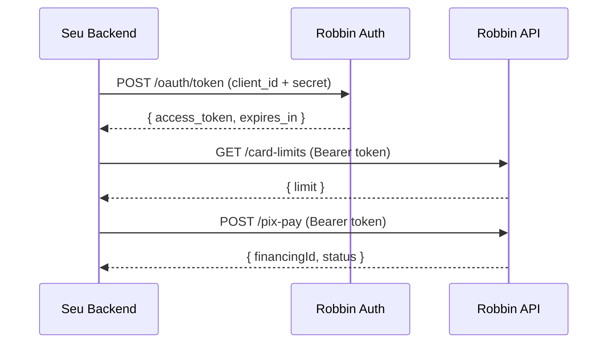

# OAuth 2.0

Toda comunicação com a API Robbin Pay é autenticada via **OAuth 2.0 Client Credentials**. Não há interação do comprador — é server-to-server entre o seu backend e a Robbin.

## Fluxo



## Obter token

<CodeGroup>
```bash cURL
curl -X POST https://bff-partner.io.robbin.com.br/oauth/token \
  -H "Content-Type: application/json" \
  -d '{
    "client_id": "your_client_id",
    "client_secret": "your_client_secret",
    "grant_type": "client_credentials"
  }'
```

```python Python
import requests

resp = requests.post(
    "https://bff-partner.io.robbin.com.br/oauth/token",
    json={
        "client_id": "your_client_id",
        "client_secret": "your_client_secret",
        "grant_type": "client_credentials",
    },
)
resp.raise_for_status()
data = resp.json()
token = data["access_token"]
```

```javascript Node.js
const resp = await fetch("https://bff-partner.io.robbin.com.br/oauth/token", {
  method: "POST",
  headers: { "Content-Type": "application/json" },
  body: JSON.stringify({
    client_id: "your_client_id",
    client_secret: "your_client_secret",
    grant_type: "client_credentials",
  }),
});

if (!resp.ok) throw new Error(`Auth failed: ${resp.status}`);
const { access_token, expires_in } = await resp.json();
```
</CodeGroup>

### Response (200)

```json
{
  "access_token": "eyJhbGciOiJSUzI1NiIs...",
  "token_type": "Bearer",
  "expires_in": 3600,
  "scope": "partner"
}
```

| Campo | Tipo | Descrição |
|-------|------|-----------|
| `access_token` | string | JWT para autenticar todas as chamadas |
| `token_type` | string | Sempre `Bearer` |
| `expires_in` | integer | Segundos até expirar (padrão: `3600` = 1 hora) |
| `scope` | string | Escopo de permissões do token |

### Erros

| Status | Causa | O que fazer |
|--------|-------|-------------|
| 401 | `client_id` ou `client_secret` inválido | Verifique as credenciais. Sandbox e produção têm credenciais diferentes. |
| 400 | `grant_type` ausente ou diferente de `client_credentials` | Corrija o body da request. |

---

## Usar o token

Inclua em **toda** request subsequente:

```
Authorization: Bearer {access_token}
```

Se o token estiver expirado ou ausente, a API retorna `401 Unauthorized`.

---

## Token management

Não existe refresh token no fluxo Client Credentials. Quando o token expirar, faça uma nova chamada a `/oauth/token`.

### Recomendação: cache com renovação antecipada

Evite pedir um token novo a cada request. Cache o token e renove alguns minutos antes de expirar.

<CodeGroup>
```python Python
import time
import requests

class RobbinAuth:
    """Cache de token com renovação automática."""

    def __init__(self, client_id: str, client_secret: str):
        self._client_id = client_id
        self._client_secret = client_secret
        self._token = None
        self._expires_at = 0

    @property
    def token(self) -> str:
        # Renova 60s antes de expirar
        if time.time() > self._expires_at - 60:
            self._refresh()
        return self._token

    def _refresh(self):
        resp = requests.post(
            "https://bff-partner.io.robbin.com.br/oauth/token",
            json={
                "client_id": self._client_id,
                "client_secret": self._client_secret,
                "grant_type": "client_credentials",
            },
        )
        resp.raise_for_status()
        data = resp.json()
        self._token = data["access_token"]
        self._expires_at = time.time() + data["expires_in"]


# Uso
auth = RobbinAuth("your_client_id", "your_client_secret")

# Em qualquer chamada — token é renovado automaticamente
resp = requests.get(
    "https://bff-partner.io.robbin.com.br/api/v1/{partner}/card-limits/12345678000190",
    headers={"Authorization": f"Bearer {auth.token}"},
)
```

```javascript Node.js
class RobbinAuth {
  #clientId;
  #clientSecret;
  #token = null;
  #expiresAt = 0;

  constructor(clientId, clientSecret) {
    this.#clientId = clientId;
    this.#clientSecret = clientSecret;
  }

  async getToken() {
    // Renova 60s antes de expirar
    if (Date.now() / 1000 > this.#expiresAt - 60) {
      await this.#refresh();
    }
    return this.#token;
  }

  async #refresh() {
    const resp = await fetch(
      "https://bff-partner.io.robbin.com.br/oauth/token",
      {
        method: "POST",
        headers: { "Content-Type": "application/json" },
        body: JSON.stringify({
          client_id: this.#clientId,
          client_secret: this.#clientSecret,
          grant_type: "client_credentials",
        }),
      }
    );
    if (!resp.ok) throw new Error(`Auth failed: ${resp.status}`);
    const data = await resp.json();
    this.#token = data.access_token;
    this.#expiresAt = Date.now() / 1000 + data.expires_in;
  }
}

// Uso
const auth = new RobbinAuth("your_client_id", "your_client_secret");

const resp = await fetch(
  "https://bff-partner.io.robbin.com.br/api/v1/{partner}/card-limits/12345678000190",
  { headers: { Authorization: `Bearer ${await auth.getToken()}` } }
);
```
</CodeGroup>

<Tip>
  Em ambientes com múltiplas instâncias (ex: Kubernetes), use um cache compartilhado (Redis, etc.) para evitar que cada pod peça um token separado.
</Tip>

---

## Rate limits

{/* TBD: confirmar rate limits reais da API */}

| Endpoint | Limite |
|----------|--------|
| `POST /oauth/token` | TBD |
| `GET /card-limits` | TBD |
| `POST /pix-pay` | TBD |

Quando disponível, o header `X-RateLimit-Remaining` indicará quantas requests restam na janela.

---

## Segurança das credenciais

<Warning>
  `client_id` e `client_secret` são o equivalente a uma senha da sua integração. Trate com o mesmo cuidado.
</Warning>

### Faça

- Armazene credenciais em variáveis de ambiente ou secret manager (AWS Secrets Manager, Vault, etc.)
- Use credenciais diferentes para sandbox e produção
- Rotacione secrets periodicamente — solicite novos à equipe Robbin

### Não faça

- Commitar credenciais em repositórios Git
- Logar tokens em plaintext
- Usar credenciais de produção em ambiente de desenvolvimento
- Expor credenciais em código client-side, apps mobile ou SPAs
