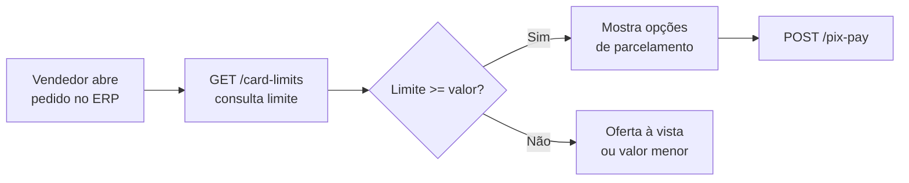

# Card Limits

O endpoint `GET /api/v1/{partner}/card-limits/{taxId}` retorna o limite de crédito disponível de um comprador. Use antes de oferecer opções de parcelamento no seu ERP ou checkout.

## Quando usar

- **Antes de mostrar opções de parcelas** — saiba quanto o comprador pode financiar.
- **Em tempo real no ERP** — o vendedor consulta o limite enquanto negocia.
- **Validação pré-Pix Pay** — evite chamar `/pix-pay` com valor acima do limite (retornaria `422`).

---

## Request

```
GET /api/v1/{partner}/card-limits/{taxId}
Authorization: Bearer {access_token}
```

| Parâmetro | Tipo | Local | Descrição |
|-----------|------|-------|-----------|
| `partner` | string | path | Slug do seu namespace (fornecido pela Robbin). |
| `taxId` | string | path | CNPJ do comprador (apenas dígitos, 14 chars). |

### Exemplos

<CodeGroup>
```bash cURL
curl -X GET "https://bff-partner.io.robbin.com.br/api/v1/{partner}/card-limits/12345678000190" \
  -H "Authorization: Bearer $TOKEN"
```

```python Python
resp = requests.get(
    f"https://bff-partner.io.robbin.com.br/api/v1/{PARTNER}/card-limits/12345678000190",
    headers={"Authorization": f"Bearer {auth.token}"},
)
resp.raise_for_status()
limits = resp.json()
print(f"Limite disponível: R$ {limits['availableLimit']:,.2f}")
```

```javascript Node.js
const resp = await fetch(
  `https://bff-partner.io.robbin.com.br/api/v1/${PARTNER}/card-limits/12345678000190`,
  { headers: { Authorization: `Bearer ${await auth.getToken()}` } }
);

if (!resp.ok) throw new Error(`Erro: ${resp.status}`);
const limits = await resp.json();
console.log(`Limite disponível: R$ ${limits.availableLimit}`);
```
</CodeGroup>

---

## Response

### 200 OK

{/* TBD: confirmar schema real do response */}

```json
{
  "taxId": "12345678000190",
  "totalLimit": 100000.00,
  "usedLimit": 30000.00,
  "availableLimit": 70000.00
}
```

| Campo | Tipo | Descrição |
|-------|------|-----------|
| `taxId` | string | CNPJ consultado |
| `totalLimit` | number | Limite total aprovado (R$) |
| `usedLimit` | number | Limite em uso por financiamentos ativos (R$) |
| `availableLimit` | number | Limite disponível para novas operações (R$) |

<Note>
  O schema de response acima é provisório. Será confirmado e atualizado.
</Note>

### Erros

| Status | Causa | O que fazer |
|--------|-------|-------------|
| **401** | Token expirado ou ausente | [Renove o token](/authentication/oauth) |
| **404** | CNPJ não encontrado | Comprador não cadastrado ou não aprovado na Robbin. |

---

## Uso no fluxo de venda



---

## Boas práticas

<AccordionGroup>
  <Accordion title="Consulte a cada pedido — não faça cache longo">
    O limite muda conforme o comprador paga faturas ou faz novas compras. Consulte no início da negociação e novamente antes do `/pix-pay` se a sessão for longa.
  </Accordion>
  <Accordion title="Não exponha o limite total ao comprador">
    O limite é informação para o seu sistema. Mostre apenas as opções de parcelamento viáveis.
  </Accordion>
  <Accordion title="Trate 404 como 'comprador não elegível'">
    Se o CNPJ não retornar limite, o comprador não foi cadastrado ou aprovado. Direcione para o cadastro no app Robbin.
  </Accordion>
</AccordionGroup>
