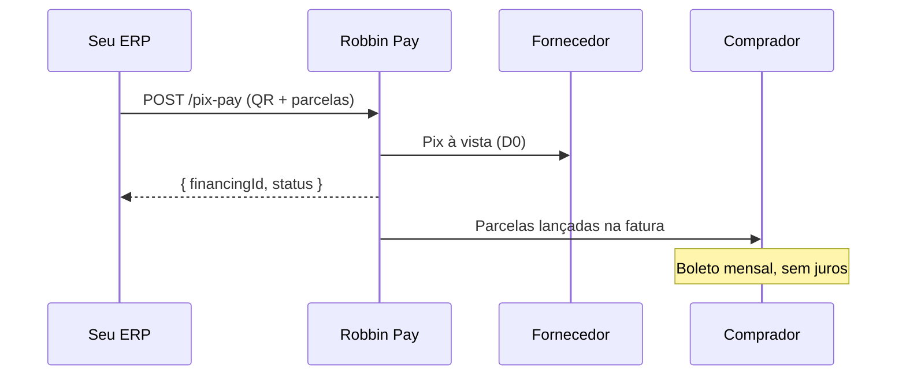

# A API de financiamento B2B

Robbin Pay transforma o seu ERP em canal de financiamento. Uma chamada, e a Robbin paga o Pix à vista pro fornecedor e parcela a cobrança pro comprador em até 6x sem juros.

<CardGroup cols={3}>
  <Card title="Pix à vista" icon="bolt">
    Fornecedor recebe na hora via Pix. Zero fricção.
  </Card>
  <Card title="Até 6x sem juros" icon="credit-card">
    Comprador parcela. Fatura mensal via boleto.
  </Card>
  <Card title="3 endpoints" icon="code">
    Auth, limite, pagamento. Tudo que você precisa.
  </Card>
</CardGroup>

---

## Como funciona



1. **Seu ERP chama a API** com o QR Code Pix e as condições de parcelamento
2. **Robbin paga o Pix** à vista ao fornecedor — dinheiro cai na hora
3. **CCB é emitida** por uma SCD autorizada pelo Bacen em nome do comprador
4. **Comprador paga** parcelas mensais via boleto — a Robbin cuida da cobrança

---

## Endpoints

Cada parceiro recebe um **namespace isolado** na API:

```
https://bff-partner.io.robbin.com.br/api/v1/{partner}/...
```

| Método | Endpoint | O que faz |
|--------|----------|-----------|
| `POST` | `/oauth/token` | Obter access token |
| `GET` | `/api/v1/{partner}/card-limits/{taxId}` | Consultar limite do comprador |
| `POST` | `/api/v1/{partner}/payments/pix-pay` | Disparar Pix Pay parcelado |

---

## Quem é quem

<CardGroup cols={3}>
  <Card title="Parceiro (você)" icon="building">
    Indústria ou distribuidor que vende pra lojistas PJ. Integra o ERP via API.
  </Card>
  <Card title="Comprador" icon="store">
    Lojista PJ que compra de você. Parcela sem juros via fatura Robbin.
  </Card>
  <Card title="Robbin" icon="shield-halved">
    Origina o financiamento, paga o Pix, gere a cobrança.
  </Card>
</CardGroup>

---

<Note>
  Alguns campos desta documentação estão marcados como **TBD** — serão preenchidos durante o onboarding com a equipe Robbin (dados de sandbox, SLA, webhooks reais).
</Note>

## Comece agora

<CardGroup cols={2}>
  <Card title="Quickstart" icon="rocket" href="/quickstart">
    Da autenticação ao primeiro pagamento em 5 minutos.
  </Card>
  <Card title="API Reference" icon="code" href="/api-reference/pix-pay">
    Explore os endpoints com playground interativo.
  </Card>
</CardGroup>
