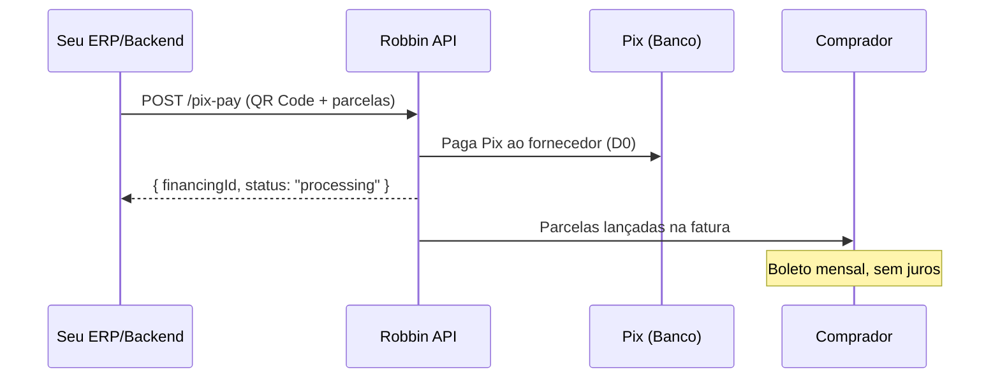

# Pix Pay

O endpoint `POST /api/v1/{partner}/payments/pix-pay` é o coração da integração. Ele recebe um QR Code Pix e um plano de parcelamento, executa o pagamento imediato ao fornecedor, e cria um financiamento parcelado para o comprador.

<Info>
  O Pix sai na hora para o fornecedor. O comprador paga parcelas mensais via boleto, sem juros.
</Info>

## Como funciona



---

## Request

```
POST /api/v1/{partner}/payments/pix-pay
Authorization: Bearer {access_token}
Content-Type: application/json
```

### Body

| Campo | Tipo | Obrigatório | Descrição |
|-------|------|-------------|-----------|
| `pixPayload` | string | Sim | Payload do QR Code Pix (campo `brcode` do QR). Emitido pelo fornecedor. |
| `taxId` | string | Sim | CNPJ do comprador (apenas dígitos, 14 chars). |
| `totalAmount` | number | Sim | Valor total em reais (mínimo: R$ 0,01). Ex: `15000.00` para R$ 15.000. |
| `installments` | integer | Sim | Número de parcelas (1 a 6). |
| `installmentAmounts` | number[] | Sim | Valor de cada parcela em reais. A soma deve ser igual a `totalAmount`. |
| `metadata` | object | Não | Dados adicionais do seu sistema (pedido, NF, vendedor). Armazenados mas não processados. |

### Exemplos

<CodeGroup>
```bash cURL — 3x de R$ 10.000
curl -X POST https://bff-partner.io.robbin.com.br/api/v1/{partner}/payments/pix-pay \
  -H "Authorization: Bearer $TOKEN" \
  -H "Content-Type: application/json" \
  -d '{
    "pixPayload": "00020126580014br.gov.bcb.pix0136a1b2c3d4-e5f6-7890-abcd-ef1234567890520400005303986540110000.005802BR5913Fornecedor SA6008Curitiba62070503***6304ABCD",
    "taxId": "12345678000190",
    "totalAmount": 30000.00,
    "installments": 3,
    "installmentAmounts": [10000.00, 10000.00, 10000.00],
    "metadata": {
      "orderId": "PED-2026-001",
      "invoiceNumber": "NF-55012",
      "sellerName": "João Silva"
    }
  }'
```

```python Python
import requests

resp = requests.post(
    f"https://bff-partner.io.robbin.com.br/api/v1/{PARTNER}/payments/pix-pay",
    headers={"Authorization": f"Bearer {auth.token}"},
    json={
        "pixPayload": "00020126580014br.gov.bcb.pix0136...",
        "taxId": "12345678000190",
        "totalAmount": 30000.00,
        "installments": 3,
        "installmentAmounts": [10000.00, 10000.00, 10000.00],
        "metadata": {
            "orderId": "PED-2026-001",
            "invoiceNumber": "NF-55012",
        },
    },
)
resp.raise_for_status()
financing = resp.json()
print(f"Financing ID: {financing['financingId']}")
```

```javascript Node.js
const resp = await fetch(
  `https://bff-partner.io.robbin.com.br/api/v1/${PARTNER}/payments/pix-pay`,
  {
    method: "POST",
    headers: {
      Authorization: `Bearer ${await auth.getToken()}`,
      "Content-Type": "application/json",
    },
    body: JSON.stringify({
      pixPayload: "00020126580014br.gov.bcb.pix0136...",
      taxId: "12345678000190",
      totalAmount: 30000.00,
      installments: 3,
      installmentAmounts: [10000.00, 10000.00, 10000.00],
      metadata: {
        orderId: "PED-2026-001",
        invoiceNumber: "NF-55012",
      },
    }),
  }
);

if (!resp.ok) {
  const err = await resp.json();
  throw new Error(`${err.title}: ${err.message}`);
}

const { financingId, status } = await resp.json();
```
</CodeGroup>

---

## Response

### 201 Created

```json
{
  "financingId": "fin_a1b2c3d4e5f6",
  "status": "processing",
  "message": "Pix payment initiated successfully"
}
```

| Campo | Tipo | Descrição |
|-------|------|-----------|
| `financingId` | string | ID único do financiamento. Use para rastrear status. |
| `status` | string | Status inicial — sempre `processing` no momento da criação. |
| `message` | string \| null | Mensagem descritiva (opcional). |

<Note>
  `status: "processing"` significa que o Pix está sendo executado. O status final chega via [webhook](/payments/webhooks).
</Note>

---

### Erros

Todos seguem o formato padrão de erro da API:

```json
{
  "title": "insufficient_limit",
  "message": "Customer does not have enough credit limit for this transaction."
}
```

| Status | Title | Causa | O que fazer |
|--------|-------|-------|-------------|
| **400** | `invalid_request` | Body malformado, campo ausente ou tipo errado | Verifique o body. A soma de `installmentAmounts` deve ser igual a `totalAmount`. |
| **404** | `customer_not_found` | `taxId` não encontrado | Confirme que o comprador foi cadastrado e aprovado. |
| **422** | `insufficient_limit` | Limite insuficiente | Consulte [`/card-limits`](/credit/card-limits) e ofereça valor menor. |
| **422** | `invalid_pix_payload` | QR Code Pix inválido ou expirado | Solicite novo QR ao fornecedor. |
| **422** | `installments_mismatch` | `installments` ≠ tamanho de `installmentAmounts` | Array deve ter exatamente N elementos. |
| **422** | `amount_mismatch` | Soma de `installmentAmounts` ≠ `totalAmount` | Recalcule os valores. [Veja ajuste de centavos](#valores). |
| **500** | `internal_error` | Erro interno | Retry com backoff exponencial. Se persistir, contate suporte. |

---

## Regras de negócio

### Parcelas

| Regra | Valor |
|-------|-------|
| Mínimo de parcelas | 1 (à vista via Robbin) |
| Máximo de parcelas | 6 |
| Soma de `installmentAmounts` | Deve ser **exatamente** igual a `totalAmount` |
| Valor mínimo `totalAmount` | R$ 0,01 |

### Valores

- `totalAmount` e `installmentAmounts` são em **reais** (não centavos). Use casas decimais: `15000.00`.
- Sem juros para o comprador — as parcelas são iguais (ou quase, ajustando centavos).

**Exemplo de ajuste de centavos em 3x:**

```json
{
  "totalAmount": 10000.00,
  "installments": 3,
  "installmentAmounts": [3333.34, 3333.33, 3333.33]
}
```

### Pix

- O `pixPayload` é o conteúdo bruto do QR Code Pix (formato EMV/BRCode).
- A Robbin paga o Pix imediatamente (D0) para o fornecedor.
- QRs expirados retornam `422 invalid_pix_payload`.

### Metadata

Campo livre — armazene o que fizer sentido para reconciliação:

```json
{
  "metadata": {
    "orderId": "PED-2026-001",
    "invoiceNumber": "NF-55012",
    "sellerName": "João Silva"
  }
}
```

<Tip>
  Incluir `orderId` e `invoiceNumber` facilita reconciliação financeira. Recomendamos fortemente.
</Tip>

---

## Fluxo completo recomendado

<Steps>
  <Step title="Consulte o limite">
    `GET /card-limits/{taxId}` — verifique se o comprador tem saldo. [Ver docs →](/credit/card-limits)
  </Step>
  <Step title="Monte a oferta">
    Com base no limite disponível, calcule opções de parcelamento (1x a 6x).
  </Step>
  <Step title="Execute o Pix Pay">
    `POST /pix-pay` com QR Code, valor e parcelas escolhidas.
  </Step>
  <Step title="Acompanhe o status">
    Guarde o `financingId`. O status evolui de `processing` → `succeeded` ou `failed` via [webhook](/payments/webhooks).
  </Step>
</Steps>

---

## Idempotência

{/* TBD: confirmar se existe idempotency key */}

<Warning>
  Chamadas duplicadas com o mesmo `pixPayload` podem resultar em pagamentos duplicados. Implemente controle de idempotência no seu lado — verifique se o `orderId` já foi processado antes de chamar.
</Warning>
