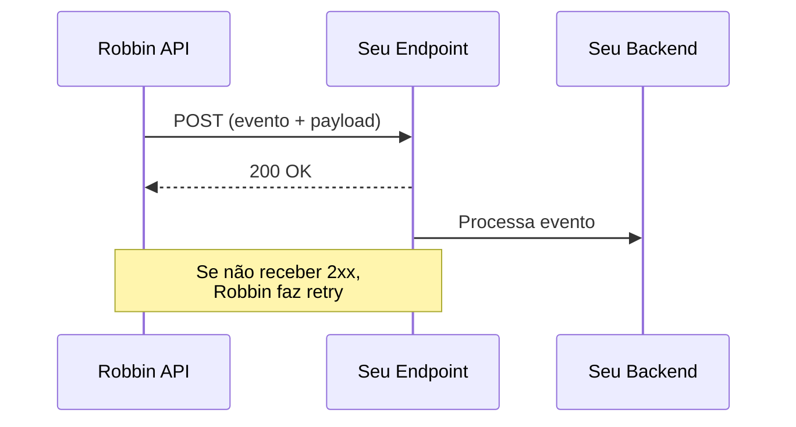

# Webhooks

Webhooks permitem que a Robbin notifique seu sistema quando o status de um financiamento muda — sem polling.

<Info>
  Webhooks são o mecanismo principal para acompanhar o ciclo de vida de um Pix Pay. Não dependa apenas do response síncrono.
</Info>

---

## Como funciona



1. A Robbin faz um `POST` para a URL que você configurou.
2. Seu endpoint retorna `2xx` para confirmar recebimento.
3. Se não receber resposta ou receber `5xx`, a Robbin faz retry.

---

## Configuração

{/* TBD: confirmar como a URL de webhook é configurada — dashboard? API? Onboarding? */}

<Note>
  A URL do webhook é configurada durante o onboarding com a equipe Robbin. Para alterar, entre em contato via email.
</Note>

### Requisitos do endpoint

| Requisito | Detalhe |
|-----------|---------|
| **Protocolo** | HTTPS obrigatório |
| **Método** | Aceitar `POST` |
| **Response** | Retornar `2xx` em até 5 segundos |
| **Idempotência** | Tratar eventos duplicados (`financingId` + `event`) |

---

## Eventos

{/* TBD: lista definitiva de eventos e payloads reais */}

Cada evento corresponde a uma transição do campo `status` no response do Pix Pay:

| Evento webhook | Status do financiamento |
|---------------|----------------------|
| `payment.processing` | `processing` |
| `payment.succeeded` | `succeeded` |
| `payment.failed` | `failed` |

### `payment.processing`

O Pix Pay foi iniciado.

```json
{
  "event": "payment.processing",
  "financingId": "fin_a1b2c3d4e5f6",
  "taxId": "12345678000190",
  "totalAmount": 30000.00,
  "installments": 3,
  "timestamp": "2026-03-24T14:30:00Z"
}
```

### `payment.succeeded`

O Pix foi executado e o financiamento está ativo.

```json
{
  "event": "payment.succeeded",
  "financingId": "fin_a1b2c3d4e5f6",
  "taxId": "12345678000190",
  "totalAmount": 30000.00,
  "installments": 3,
  "pixTransactionId": "E12345678202603241430abcdef123456",
  "timestamp": "2026-03-24T14:30:05Z"
}
```

### `payment.failed`

O Pix falhou (QR expirado, erro bancário, etc.).

```json
{
  "event": "payment.failed",
  "financingId": "fin_a1b2c3d4e5f6",
  "taxId": "12345678000190",
  "totalAmount": 30000.00,
  "failureReason": "PIX_EXPIRED",
  "timestamp": "2026-03-24T14:30:10Z"
}
```

<Warning>
  Os payloads acima são provisórios. A estrutura definitiva será confirmada e esta página atualizada.
</Warning>

---

## Segurança

### Verificação de assinatura

{/* TBD: confirmar mecanismo real — header name, algoritmo, onde pegar o secret */}

Toda chamada de webhook inclui um header de assinatura para verificar autenticidade:

```
X-Robbin-Signature: sha256=a1b2c3d4e5f6...
```

<CodeGroup>
```python Python
import hashlib
import hmac

def verify_webhook(payload: bytes, signature: str, secret: str) -> bool:
    expected = hmac.new(
        secret.encode(), payload, hashlib.sha256
    ).hexdigest()
    received = signature.removeprefix("sha256=")
    return hmac.compare_digest(expected, received)


@app.post("/webhooks/robbin")
async def handle_webhook(request: Request):
    payload = await request.body()
    signature = request.headers.get("X-Robbin-Signature", "")

    if not verify_webhook(payload, signature, WEBHOOK_SECRET):
        return Response(status_code=401)

    event = await request.json()
    # Processar evento...
    return Response(status_code=200)
```

```javascript Node.js
const crypto = require("crypto");

function verifyWebhook(payload, signature, secret) {
  const expected = crypto
    .createHmac("sha256", secret)
    .update(payload)
    .digest("hex");
  const received = signature.replace("sha256=", "");
  return crypto.timingSafeEqual(
    Buffer.from(expected),
    Buffer.from(received)
  );
}

app.post("/webhooks/robbin", express.raw({ type: "*/*" }), (req, res) => {
  const signature = req.headers["x-robbin-signature"] || "";

  if (!verifyWebhook(req.body, signature, WEBHOOK_SECRET)) {
    return res.sendStatus(401);
  }

  const event = JSON.parse(req.body);
  // Processar evento...
  res.sendStatus(200);
});
```
</CodeGroup>

<Warning>
  Header e algoritmo de assinatura são provisórios. Serão confirmados no onboarding.
</Warning>

---

## Retry policy

{/* TBD: confirmar política real */}

| Tentativa | Delay |
|-----------|-------|
| 1ª | ~1 minuto |
| 2ª | ~5 minutos |
| 3ª | ~30 minutos |
| 4ª | ~2 horas |
| 5ª | ~12 horas |

Após 5 tentativas sem sucesso, contate a equipe Robbin para reprocessamento.

---

## Boas práticas

<AccordionGroup>
  <Accordion title="Responda 200 rápido, processe depois">
    Retorne `200` imediatamente e processe o evento de forma assíncrona (fila, background job). Operações pesadas no handler causam timeout.
  </Accordion>
  <Accordion title="Trate duplicatas">
    O mesmo evento pode chegar mais de uma vez (retry, reprocessamento). Use `financingId` + `event` como chave de idempotência.
  </Accordion>
  <Accordion title="Sempre verifique a assinatura">
    Nunca processe um webhook sem verificar. Request sem assinatura válida → `401`.
  </Accordion>
  <Accordion title="Logue o payload completo">
    Armazene tudo. Facilita debugging e reconciliação.
  </Accordion>
  <Accordion title="Monitore falhas">
    Alerte se seu endpoint começar a retornar `5xx`. Webhooks perdidos = status desatualizado no seu sistema.
  </Accordion>
</AccordionGroup>
