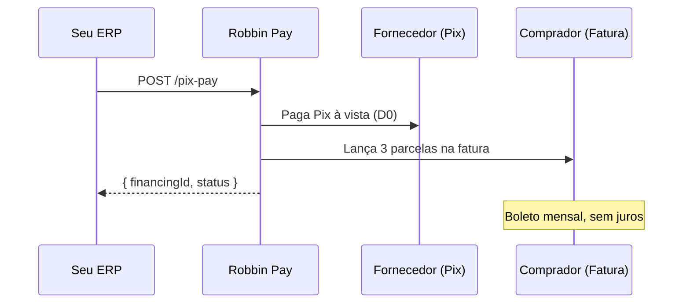

# Quickstart

Três chamadas. Cinco minutos. Autenticar → consultar limite → disparar pagamento.

<Info>
  **Pré-requisito:** credenciais (`client_id` + `client_secret`) fornecidas pela equipe Robbin via email.
  Não tem? Entre em contato com seu ponto focal.
</Info>

---

## 1. Autentique

<CodeGroup>
```bash cURL
curl -X POST https://bff-partner.io.robbin.com.br/oauth/token \
  -H "Content-Type: application/json" \
  -d '{
    "client_id": "your_client_id",
    "client_secret": "your_client_secret",
    "grant_type": "client_credentials"
  }'
```

```python Python
import requests

resp = requests.post(
    "https://bff-partner.io.robbin.com.br/oauth/token",
    json={
        "client_id": "your_client_id",
        "client_secret": "your_client_secret",
        "grant_type": "client_credentials",
    },
)
token = resp.json()["access_token"]
```

```javascript Node.js
const resp = await fetch("https://bff-partner.io.robbin.com.br/oauth/token", {
  method: "POST",
  headers: { "Content-Type": "application/json" },
  body: JSON.stringify({
    client_id: "your_client_id",
    client_secret: "your_client_secret",
    grant_type: "client_credentials",
  }),
});
const { access_token } = await resp.json();
```
</CodeGroup>

```json Response
{
  "access_token": "eyJhbGciOiJSUzI1NiIs...",
  "token_type": "Bearer",
  "expires_in": 3600,
  "scope": "partner"
}
```

Use o `access_token` como `Authorization: Bearer {token}` em todas as chamadas seguintes.

---

## 2. Consulte o limite

Antes de oferecer parcelamento, verifique quanto o comprador tem disponível:

<CodeGroup>
```bash cURL
curl https://bff-partner.io.robbin.com.br/api/v1/{partner}/card-limits/12345678000190 \
  -H "Authorization: Bearer $TOKEN"
```

```python Python
limits = requests.get(
    f"https://bff-partner.io.robbin.com.br/api/v1/{PARTNER}/card-limits/12345678000190",
    headers={"Authorization": f"Bearer {token}"},
).json()
```

```javascript Node.js
const limits = await fetch(
  `https://bff-partner.io.robbin.com.br/api/v1/${PARTNER}/card-limits/12345678000190`,
  { headers: { Authorization: `Bearer ${access_token}` } }
).then((r) => r.json());
```
</CodeGroup>

```json Response
{
  "taxId": "12345678000190",
  "totalLimit": 100000.00,
  "usedLimit": 30000.00,
  "availableLimit": 70000.00
}
```

<Note>
  Substitua `{partner}` pelo slug do seu namespace e o CNPJ pelo do comprador, sem pontuação.
</Note>

---

## 3. Dispare o Pix Pay

Envie o QR Code Pix e as condições de parcelamento. A Robbin paga o fornecedor na hora:

<CodeGroup>
```bash cURL
curl -X POST https://bff-partner.io.robbin.com.br/api/v1/{partner}/payments/pix-pay \
  -H "Authorization: Bearer $TOKEN" \
  -H "Content-Type: application/json" \
  -d '{
    "pixPayload": "00020126580014br.gov.bcb.pix...",
    "taxId": "12345678000190",
    "totalAmount": 10000.00,
    "installments": 3,
    "installmentAmounts": [3333.34, 3333.33, 3333.33],
    "metadata": {
      "orderId": "ORD-2026-001"
    }
  }'
```

```python Python
payment = requests.post(
    f"https://bff-partner.io.robbin.com.br/api/v1/{PARTNER}/payments/pix-pay",
    headers={"Authorization": f"Bearer {token}"},
    json={
        "pixPayload": "00020126580014br.gov.bcb.pix...",
        "taxId": "12345678000190",
        "totalAmount": 10000.00,
        "installments": 3,
        "installmentAmounts": [3333.34, 3333.33, 3333.33],
        "metadata": {"orderId": "ORD-2026-001"},
    },
).json()
```

```javascript Node.js
const payment = await fetch(
  `https://bff-partner.io.robbin.com.br/api/v1/${PARTNER}/payments/pix-pay`,
  {
    method: "POST",
    headers: {
      Authorization: `Bearer ${access_token}`,
      "Content-Type": "application/json",
    },
    body: JSON.stringify({
      pixPayload: "00020126580014br.gov.bcb.pix...",
      taxId: "12345678000190",
      totalAmount: 10000.0,
      installments: 3,
      installmentAmounts: [3333.34, 3333.33, 3333.33],
      metadata: { orderId: "ORD-2026-001" },
    }),
  }
).then((r) => r.json());
```
</CodeGroup>

```json Response (201)
{
  "financingId": "fin_abc123",
  "status": "processing",
  "message": "Payment is being processed"
}
```

<Check>
  Pronto. A Robbin pagou o Pix à vista pro fornecedor. O comprador receberá a fatura mensal com 3 parcelas de R$ 3.333,33.
</Check>

---

## O que aconteceu



---

## Próximos passos

<CardGroup cols={3}>
  <Card title="Pix Pay em detalhe" icon="money-bill" href="/payments/pix-pay">
    Todos os campos, edge cases, regras.
  </Card>
  <Card title="Webhooks" icon="bell" href="/payments/webhooks">
    Receba status updates em tempo real.
  </Card>
  <Card title="Error handling" icon="triangle-exclamation" href="/guides/error-handling">
    Retry, backoff, tratamento por error code.
  </Card>
</CardGroup>
